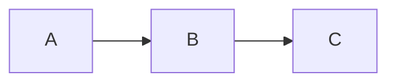

# Project Documentation

Use this template to create consistent, clean, modular technical docs.

---

## 1. Overview
Short summary of what the system does and why it exists.

---

## 2. Architecture
Describe components, how they interact, and a high-level diagram.

### Architecture Diagram (ASCII)
```
Component A --> Component B --> Component C
```

### Mermaid (optional)


---

## 3. Processing Pipeline
Step-by-step flow of how the system processes input.

1. Step 1  
2. Step 2  
3. Step 3  

---

## 4. Metrics & Performance
Detailed tables, charts, and how metrics are generated.

### Metrics Table
| Metric | Value | Notes |
|--------|-------|-------|
| example_metric | 0.00 | description |

### Insert Charts
```
Place PNGs into ./assets/ and reference them:

```

---

## 5. Code Examples
Show runnable snippets or important logic.

```python
def example():
    return "hello world"
```

---

## 6. Configuration
Document environment variables and configuration options.

```
ENV_VAR=value
```

---

## 7. Deployment
Explain how to deploy locally and in production.

---

## 8. Troubleshooting
List common problems and their resolutions.

---

## 9. FAQ
Short answers to expected questions.

---

## 10. Appendix
Extra notes, tables, and references.
