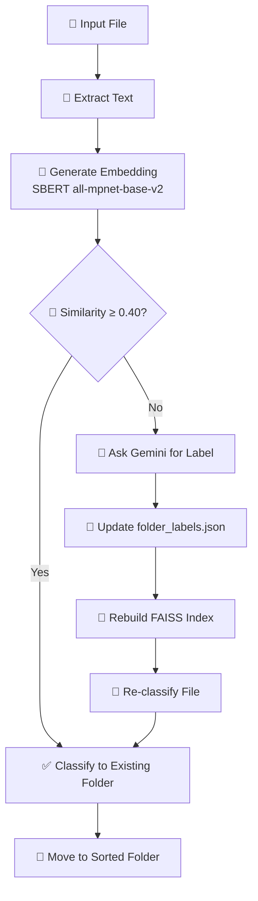

**Semantic document classifier that understands meaning, not just filenames.**

FileSense uses **SentenceTransformers (SBERT)** and **FAISS vector search** to organize files by their actual content. When it encounters unknown file types, it leverages **Google Gemini** to generate new categories automatically.

---

## ⚠️ MAJOR UPDATE: The Shift to SFT

**TL;DR: API Rate limits have broken the real-time workflow. I am pivoting to Supervised Fine-Tuning (SFT).**

### The Rate Limit Bottleneck
As documented in recent logs (`RL_RATE_LIMIT_RAGEBAIT.log`), relying on the free/standard tier of the Gemini API has become untenable for a high-volume file organizer.

*   **Massive Delays:** The API is enforcing severe backoff times.
    > `[!] Rate Limit Hit on attempt 2/5 ... Google requested wait: 59.55s`
*   **Pipeline Freezes:** When organizing batches of files (e.g., 8-10 files), the script spends more time sleeping than processing.
*   **Fallback Failures:** Even with retries, many requests eventually degrade to non-interactive mode or fail completely, requiring manual intervention.

### The Resolution: Local SFT
Instead of optimizing prompt engineering or RL agents to *minimize* calls, the only robust solution is to **remove the dependency entirely**.

I am now collecting the high-quality labeled data generated so far to **Supervised Fine-Tune (SFT)** a truncated, local model (Small Language Model). This will allow FileSense to:
1.  **Run Offline:** Zero internet dependency.
2.  **Zero Latency:** No HTTP requests or 60s wait times.
3.  **Privacy:** No file content leaves your machine.

---

## ⚡ Quick Links

*   **[Getting Started](/FileSense/wiki/getting-started/)**: Install and run FileSense in 5 minutes
*   **[Performance Metrics](/FileSense/wiki/metrics/)**: See benchmarks and optimization studies

---

## 🎯 Core Features

| Feature | Description |
|---------|-------------|
| 🧠 **Semantic Sorting** | Classifies by meaning (e.g., "Newton's Laws" → Physics) |
| 🤖 **AI-Powered Labeling** | Uses Gemini to generate new categories automatically |
| ⚡ **FAISS Vector Search** | Lightning-fast similarity matching with embeddings |
| 🔄 **Self-Updating** | Automatically rebuilds index when new labels are created |
| 👀 **OCR Support** | Extracts text from scanned PDFs and images |
| 🧩 **Keyword Boosting** | Hybrid approach: Vector similarity + keyword matching |
| 🖥️ **GUI & CLI** | Desktop app with system tray + command-line interface |
| 🧵 **Multithreading** | Process hundreds of files in parallel |

---

## 📊 How It Works



---

## 🚀 Quick Start

```bash
# 1. Install dependencies
pip install -r requirements.txt

# 2. Set up API key
echo "API_KEY=your_gemini_key" > .env

# 3. Create initial index
python scripts/create_index.py

# 4. Run FileSense
python scripts/script.py --dir ./files --threads 6
```

---

## 📚 Documentation Sections

### 🎓 For Users
- **[Getting Started](/FileSense/wiki/getting-started/)** - Installation and setup
- **[FAQ](/FileSense/wiki/faq/)** - Common questions and troubleshooting

### 🔧 For Developers
- **[Architecture](/FileSense/wiki/pipeline/)** - System design and data flow


### 📊 Research & Analysis
- **[Performance Metrics](/FileSense/wiki/metrics/)** - Benchmarks and accuracy
- **[NL vs Keywords Study](/FileSense/wiki/NL_VS_OG/)** - Comprehensive comparison
- **[Lessons Learned](/FileSense/wiki/lessons-learned/)** - Key insights from development

---

## 🎓 Key Insights

> **Important discoveries from testing:**
> 
> 1. **Keyword-based descriptions outperform natural language** for SBERT embeddings (+32% accuracy)
> 2. **Semantic descriptions performed worse** than expected (24% vs 56% accuracy)
> 3. **Lighter models significantly reduced performance** - stick with all-mpnet-base-v2
> 4. **AG News dataset showed poor results** - academic documents work best

See the [NL vs Keywords Study](/FileSense/wiki/NL_VS_OG/) for detailed analysis.

---

## 📈 Performance Highlights

| Metric | Value |
|--------|-------|
| **Accuracy (NCERT Test)** | 56% with keywords |
| **Avg Similarity Score** | 0.355 |
| **Categorization Rate** | 89% (11% uncategorized) |
| **Processing Speed** | ~0.27s per file |
| **Embedding Model** | all-mpnet-base-v2 (768 dims) |

---

## 🤝 Contributing

FileSense is an open-source project. Contributions are welcome!

- **GitHub:** [ahhyoushh/FileSense](https://github.com/ahhyoushh/FileSense)
- **Issues:** Report bugs or request features
- **Pull Requests:** Submit improvements

---

## 📝 License

MIT License © 2025 Ayush Bhalerao

---

**Ready to get started?** → [Installation Guide](/FileSense/wiki/getting-started/)
