# 🏗️ System Architecture

Understanding how FileSense processes and classifies files.

---

## 📊 High-Level Overview

```mermaid
flowchart TB
    subgraph Input
        A[📄 Input Files<br/>PDF, DOCX, TXT, MD]
    end
    
    subgraph Extraction
        B[📝 Text Extraction<br/>pdfplumber, python-docx]
        C[🔍 Fallback Extraction<br/>Middle pages, OCR]
    end
    
    subgraph Embedding
        D[🔢 SBERT Encoding<br/>all-mpnet-base-v2<br/>768 dimensions]
    end
    
    subgraph Search
        E[🎯 FAISS Vector Search<br/>IndexFlatIP<br/>Cosine Similarity]
        F{Similarity ≥ 0.40?}
    end
    
    subgraph Classification
        G[✅ High Confidence<br/>Assign to Folder]
        H[🤖 Low Confidence<br/>Ask Gemini]
    end
    
    subgraph Update
        I[💾 Update Labels<br/>folder_labels.json]
        J[🔄 Rebuild Index<br/>FAISS re-indexing]
        K[🔁 Re-classify]
    end
    
    subgraph Output
        L[📁 Move to Sorted Folder]
    end
    
    A --> B
    B --> C
    C --> D
    D --> E
    E --> F
    F -->|Yes| G
    F -->|No| H
    H --> I
    I --> J
    J --> K
    K --> E
    G --> L
```



---

## 🔄 Processing Pipeline

### Step 1: Text Extraction

**File:** `scripts/extract_text.py`

```python
def extract_text(file_path, fallback=False):
    """
    Extract text from PDF, DOCX, or TXT files.
    
    Args:
        file_path: Path to the file
        fallback: If True, extract from middle pages (avoid TOC)
    
    Returns:
        Extracted text (max 2000 chars)
    """
```

**Features:**
- **PDF:** Uses `pdfplumber` with smart page selection
- **DOCX:** Extracts paragraphs with `python-docx`
- **TXT:** Direct file reading with encoding detection
- **Fallback:** Starts from middle pages to avoid table of contents
- **Quality scoring:** Filters low-quality pages
- **Header/footer removal:** Crops margins to get core content

**Configuration:**
```python
PDF_CONFIG = {
    'MAX_INPUT_CHARS': 2000,        # Max text length
    'QUALITY_THRESHOLD': 0.4,       # Min page quality
    'START_PAGE_ASSUMPTION': 3,     # Skip first N pages
    'HEADER_FOOTER_MARGIN': 70,     # Crop margins (pixels)
    'MIN_LINE_LENGTH': 25,          # Min line length
}
```

### Step 2: Embedding Generation

**File:** `scripts/classify_process_file.py`

```python
model = SentenceTransformer("all-mpnet-base-v2", device="cpu")
text_emb = model.encode([text], normalize_embeddings=True)
```

**Model Details:**
- **Name:** all-mpnet-base-v2
- **Dimensions:** 768
- **Normalization:** L2 normalized for cosine similarity
- **Performance:** ~0.1s per encoding
- **Size:** 420MB (cached after first download)

**Why this model?**
{: .notice--info}

Testing showed lighter models performed **significantly worse**. This model provides the best balance of speed and accuracy for document classification.

### Step 3: Vector Similarity Search

**File:** `scripts/classify_process_file.py`

```python
# Search FAISS index
D, I = index.search(text_emb, 10)  # Top 10 matches

# Calculate similarities
for idx, sim in zip(I[0], D[0]):
    if idx != -1:
        all_sims[idx] = sim
```

**FAISS Configuration:**
- **Index Type:** IndexFlatIP (Inner Product)
- **Metric:** Cosine similarity (via normalized embeddings)
- **Top-K:** Retrieves top 10 matches
- **Boosting:** Filename and keyword matching add bonus scores

**Keyword Boosting:**
```python
FILENAME_BOOST = 0.2  # If label appears in filename
TEXT_BOOST = 0.1      # If keyword appears in filename
```

### Step 4: Classification Decision

**Thresholds:**
```python
THRESHOLD = 0.4                    # Main threshold
low_confidence_threshold = 0.35    # Fallback threshold
```

**Decision Logic:**
```python
if similarity >= 0.40:
    # High confidence - classify immediately
    return label, similarity

elif similarity >= 0.35:
    # Medium confidence - accept with warning
    print("[!] Low confidence but accepting as fallback")
    return label, similarity

else:
    # Low confidence - generate new label
    if allow_generation:
        generate_new_label_via_gemini()
    else:
        return "Uncategorized", 0.0
```

### Step 5: Label Generation (Gemini)

**File:** `scripts/generate_label.py`

```python
def generate_folder_label(target_text, forced_label=None):
    """
    Generate or update folder label using Gemini.
    
    Args:
        target_text: Document text + filename
        forced_label: Optional manual label override
    
    Returns:
        {
            "folder_label": "Physics",
            "description": "mechanics, forces, energy, ...",
            "keywords": "physics, motion, force, ..."
        }
    """
```

**Prompt Strategy:**
- **Keyword-based descriptions** (proven superior to natural language)
- **Existing labels context** (prefer reuse over new creation)
- **Broad categorization** (Physics, not Thermodynamics)
- **15 focused examples** covering edge cases

**Merging Logic:**
When a label already exists, FileSense **merges** new terminology with existing:

```python
def merge_folder_metadata(folder_label, old_desc, old_kw, new_desc, new_kw):
    """
    Intelligently merge metadata preserving all unique terms.
    
    Hard requirement: NO terms from old metadata are lost.
    """
```

### Step 6: Index Rebuild

**File:** `scripts/create_index.py`

```python
def create_faiss_index():
    # Load labels
    folder_data = json.load("folder_labels.json")
    
    # Generate embeddings
    combined_desc = [f"{label}: {desc}" for label, desc in folder_data.items()]
    embeddings = model.encode(combined_desc, normalize_embeddings=True)
    
    # Build FAISS index
    index = faiss.IndexFlatIP(768)  # 768 dimensions
    index.add(embeddings)
    
    # Save to disk
    faiss.write_index(index, "folder_embeddings.faiss")
```

**Performance:**
- **Speed:** ~1.5s for 10 labels
- **Scaling:** Linear with number of labels
- **Memory:** ~3KB per label

---

## 🗂️ Data Structures

### folder_labels.json

**Format:**
```json
{
  "Physics": "mechanics, thermodynamics, optics, electromagnetism, quantum mechanics, relativity, forces, energy, motion, waves, heat, light, electricity, magnetism, gravity, laboratory experiments, scientific formulas, physical laws Keywords: physics, mechanics, thermodynamics, optics, quantum, energy, force, motion",
  
  "Chemistry": "organic chemistry, inorganic chemistry, chemical reactions, molecular structure, stoichiometry, titration, synthesis, bonding, compounds, purification, acids, bases Keywords: chemistry, organic, reaction, chemical, lab, synthesis, molecule"
}
```

**Structure:**
- **Key:** Folder label (broad category)
- **Value:** `{description} Keywords: {keywords}`
- **Description:** 20-40 comma-separated terms
- **Keywords:** 8-12 high-value search terms

**Why keywords, not natural language?**
{: .notice--warning}

Extensive testing showed keyword-based descriptions outperform natural language by **+32% accuracy**. See [NL vs Keywords Study](/FileSense/wiki/NL_VS_OG/).

### folder_embeddings.faiss

**Binary format** containing:
- Vector embeddings for each label
- Index structure for fast search
- Metadata for reconstruction

**Size:** ~3KB per label (768 float32 values)

---

## 🧵 Multithreading Architecture

**File:** `scripts/multhread.py`

```python
def process_multiple(files_dir, max_threads, testing=False, allow_generation=True):
    """
    Process files in parallel with thread pool.
    
    Args:
        files_dir: Directory containing files
        max_threads: Maximum concurrent threads
        testing: If True, don't move files
        allow_generation: Allow Gemini label generation
    """
```

**Thread Safety:**
- **RLock:** Prevents race conditions during label generation
- **FAISS index:** Read-only after loading (thread-safe)
- **File I/O:** Each thread processes different files

**Performance:**
- **Optimal threads:** 4-8 (I/O bound)
- **Scaling:** Near-linear up to 8 threads
- **Bottleneck:** Text extraction (especially OCR)

---

## 🔍 Fallback Mechanisms

### 1. Fallback Text Extraction

If initial classification has low confidence:

```python
if similarity < 0.35:
    # Try extracting from middle of document
    fallback_text = extract_text(file_path, fallback=True)
    new_sim = classify(fallback_text)
    
    if new_sim > similarity:
        # Use fallback result
        text = fallback_text
        similarity = new_sim
```

**Why?** Many documents have table of contents or cover pages that don't represent actual content.

### 2. Threshold Lowering

When generation is disabled:

```python
if not allow_generation:
    # Lower threshold by 7%
    current_threshold -= 0.07
    
    if similarity > current_threshold:
        # Accept with lowered threshold
        return label, similarity
```

### 3. Manual Input

After max retries:

```python
if retries >= MAX_RETRIES:
    # Ask user for manual label
    manual_label = input(f"Enter label for '{filename}': ")
    
    # Optionally generate description
    if user_wants_description:
        generate_folder_label(text, forced_label=manual_label)
```

---

## 📊 Performance Characteristics

### Time Complexity

| Operation | Complexity | Notes |
|-----------|-----------|-------|
| Text Extraction | O(n) | n = file size |
| Embedding Generation | O(1) | Fixed for 2000 chars |
| FAISS Search | O(k) | k = number of labels |
| Label Generation | O(1) | API call latency |
| Index Rebuild | O(k) | k = number of labels |

### Space Complexity

| Component | Size | Scaling |
|-----------|------|---------|
| Embedding Model | 420MB | One-time |
| FAISS Index | ~3KB/label | Linear |
| folder_labels.json | ~500B/label | Linear |
| Logs | Variable | Can be disabled |

### Bottlenecks

1. **Text Extraction** (especially OCR)
   - Solution: Use more threads
   - Solution: Pre-extract text

2. **Gemini API Latency** (~1-2s per call)
   - Solution: Batch processing
   - Solution: Pre-generate common labels

3. **Model Download** (first run only)
   - Solution: Manual download and cache

---

## 🔧 Configuration Points

### Similarity Thresholds

**File:** `scripts/classify_process_file.py`
```python
THRESHOLD = 0.4                    # Adjust for strictness
low_confidence_threshold = 0.35    # Fallback threshold
```

### Text Extraction

**File:** `scripts/extract_text.py`
```python
PDF_CONFIG = {
    'MAX_INPUT_CHARS': 2000,       # Increase for longer docs
    'QUALITY_THRESHOLD': 0.4,      # Lower to accept more pages
    'START_PAGE_ASSUMPTION': 3,    # Skip more/fewer initial pages
}
```

### Embedding Model

**File:** `scripts/create_index.py`
```python
MODEL_NAME = "all-mpnet-base-v2"  # Change model here
```

### Gemini Settings

**File:** `scripts/generate_label.py`
```python
MODEL = "gemini-2.5-flash"         # Gemini model version
temperature = 0.5                  # Creativity (0.0-1.0)
```

---

## 🎓 Design Decisions

### Why FAISS over other vector DBs?

- **Fast:** Optimized for similarity search
- **Lightweight:** No server required
- **Offline:** Works without internet
- **Scalable:** Handles thousands of labels efficiently

### Why SBERT over other embeddings?

- **Semantic:** Captures meaning, not just keywords
- **Pre-trained:** No training required
- **Fast:** ~0.1s per encoding
- **Accurate:** Best performance in testing

### Why keyword descriptions?

**Proven through testing:**
- Keywords: 56% accuracy
- Natural language: 24% accuracy
- **+32% improvement** with keywords

See [NL vs Keywords Study](/FileSense/wiki/NL_VS_OG/) for details.

### Why Gemini for generation?

- **Structured output:** JSON schema support
- **Context understanding:** Analyzes document content
- **Merging logic:** Preserves existing metadata
- **Cost-effective:** Free tier available

---

## 📚 Related Documentation

- **[API Reference](/FileSense/wiki/api-reference/)** - Function documentation
- **[Performance Metrics](/FileSense/wiki/metrics/)** - Benchmarks
- **[Code Structure](/FileSense/wiki/code-structure/)** - Project organization

---

[← Back to Home](/FileSense/wiki/)
