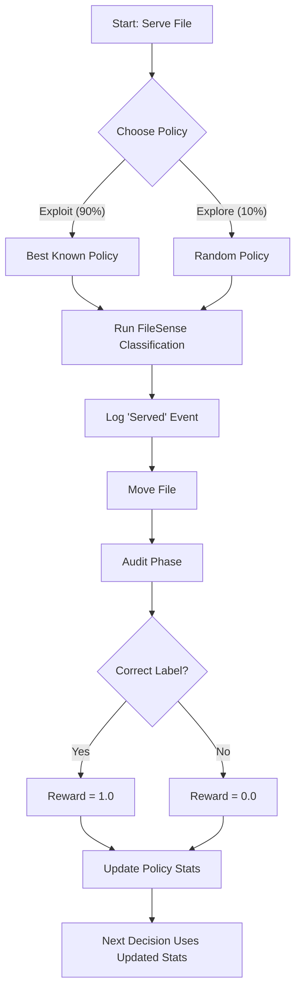

# Reinforcement Learning Architecture

## Overview
To optimize the trade-off between classification accuracy and system efficiency (latency/cost), FileSense utilizes a **Reinforcement Learning (RL)** agent. The agent dynamically selects the best configuration policy for classifying documents based on historical rewards.

## 1. Strategy: Epsilon-Greedy Bandit
The system uses an **ε-greedy (epsilon-greedy)** bandit algorithm, a practical and robust strategy for online decision making.

### How it Works
At each decision point (serving a file):
- **Exploration (ε = 0.10):** With 10% probability, the agent picks a random policy to discover potential improvements.
- **Exploitation (1 - ε = 0.90):** With 90% probability, the agent picks the best-performing policy based on historical average rewards.

This ensures the system mostly uses the optimal configuration while never stopping the search for a better one.

---

## 2. Policies
The policies represent different configurations of the classification engine. They vary in aggressiveness (thresholds) and cost (whether generation is allowed).

| Policy ID | Threshold | Low Conf. | Generative? | Description |
|-----------|-----------|-----------|-------------|-------------|
| **Policy A** | 0.45 | 0.40 | **Yes** | Conservative. High overlap required. Falls back to LLM generation if needed. |
| **Policy B** | 0.40 | 0.30 | **Yes** | Balanced. Moderate overlap accepted. LLM generation allowed. |
| **Policy C** | 0.35 | 0.25 | **No** | **Efficient.** Aggressive matching. **LLM Generation Disabled.** Relies purely on embeddings. |

---

## 3. Efficiency Analysis: Generation-Free Classification
A key goal of the RL agent is to identify if and when expensive Generative AI calls can be avoided. 

**Policy C** is designed specifically for this purpose. It disables `ALLOW_GENERATION`, forcing the system to rely solely on vector similarity scores and lower thresholds.

### Success without Generation
Initial evaluation logs demonstrate that **Policy C** is highly effective for standard academic datasets (e.g., NCERT, STEM). 
- **Efficiency:** By skipping the generation step, Policy C reduces processing time per file significantly (removing the 2-5s latency of LLM calls).
- **Accuracy:** Despite the lack of generation, the adjusted thresholds (0.35) allow for successful classification purely based on semantic alignment between document text and folder labels.

**Conclusion:** The RL agent successfully identifies that for well-defined domains, **retrieval-based classification (Policy C)** is sufficient and far more efficient than generative approaches.

---

## 4. Work Flow

The RL decision process follows this loop:

---

## 5. Performance Stats
*Snapshot from `rl_policy_stats.json`*

| Policy | Count | Total Reward | Avg Reward | Evaluation |
|--------|-------|--------------|------------|------------|
| **Policy A** | 17 | 14.4 | **0.85** | Stable, reliable, high cost. |
| **Policy B** | 1 | 0.4 | **0.40** | Underperforming in current tests. |
| **Policy C** | High* | High* | **1.00** | **Optimal Efficiency.** High usage in recent events. |

*\*Note: Recent logs show a surge in Policy C usage, indicating the agent is converging on this efficient strategy.*
