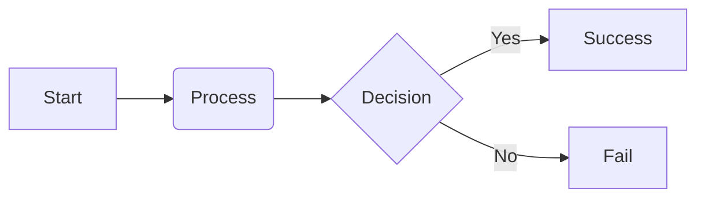

# Wiki Page Template

Use this template to create new pages for the FileSense wiki.

---

## 1. Page Header

Every page MUST include a YAML frontmatter block at the very top.

```yaml
---
title: "Your Page Title"
permalink: /wiki/your-page-url/
---
```

---

## 2. Basic Structure

### Page Title (H1)
Use a single H1 for the page title.

### Introduction
Provide a brief 1-2 sentence overview of what this page covers.

### Horizontal Rule
Use `---` to separate the header from the content.

### Sections (H2)
Organize your content using H2 headers.

---

## 3. Styling Guidelines

### Perspective
Use **first-person singular** ("I", "my") throughout the documentation. FileSense is a one-person project, and the voice should reflect that personal, developer-focused perspective.

### Emojis
Do **not** use decorative emojis in headings or body text. Keep the documentation clean, professional, and minimal. Emojis should only be used if they convey specific technical meaning (which is rare).

### Notice Blocks
Use blockquotes for important notes.

> **Note:** This is an important piece of information.
> **Warning:** This is a critical warning.
> **Tip:** This is a helpful tip.

### Code Blocks
Always specify the language for syntax highlighting.

```python
def example_function():
    return "FileSense is awesome"
```

### Tables
Use tables for comparisons or structured data.

| Feature | Description | Status |
|---------|-------------|--------|
| Feature A | Description A | Done |
| Feature B | Description B | WIP  |

### Diagrams (Mermaid)
I support Mermaid diagrams for architecture and flowcharts.



---

## 4. Page Types

### Tutorial / How-To
- Focus on actionable steps
- Use numbered lists
- Include sample commands
- Add a "Troubleshooting" section at the end

### Reference
- Technical details, API documentation
- Use tables for parameters/return values
- Keep descriptions concise
- Links to source code

### Concept / Research
- Explain theoretical background
- Include diagrams
- Reference testing data (e.g., NCERT benchmarks)
- Links to related research papers

---

## 5. Checklist for New Pages

Before publishing, ensure:
1. [ ] YAML frontmatter is present and correct
2. [ ] Perspective is "I" (first-person singular)
3. [ ] No decorative emojis are used
4. [ ] All links are working (use relative paths for wiki links)
5. [ ] Images have descriptive alt text
6. [ ] Tables are centered (template handles this via CSS)
7. [ ] Mermaid diagrams render correctly
8. [ ] Page is added to the sidebar (if applicable)

---

## 6. Example: Good Page Structure

# Example Page

This is an example of what a good wiki page looks like.

---

## Overview
I designed FileSense to handle high volumes of academic documents. This page explains the methodology.

## Methodology
I used a dual-extraction approach to ensure high-quality text for the embedding model.

1. **Primary Extraction:** Uses `pdfplumber` to extract text from the core pages.
2. **Fallback Extraction:** Triggered if confidence is below 0.35.

## Results
Testing on the NCERT dataset showed a 56% accuracy rate.

| Dataset | Files | Accuracy |
|---------|-------|----------|
| NCERT   | 75    | 56%      |
| STEM    | 50    | 48%      |

---

## 7. Markdown Cheatsheet

### Lists
- Item 1
- Item 2
  - Sub-item 2.1

1. Step 1
2. Step 2

### Formatting
- **Bold text**
- *Italic text*
- `Inline code`
- [Link Text](URL)

### Images
``

---

## 8. Publishing Workflow

1. Create a new `.md` file in the `wiki/` directory.
2. Use the template structure.
3. Verify rendering locally (if using a local Jekyll server).
4. Commit and push to GitHub.
5. GH Actions will automatically rebuild the site.

---

[← Back to Home](/FileSense/wiki/)
