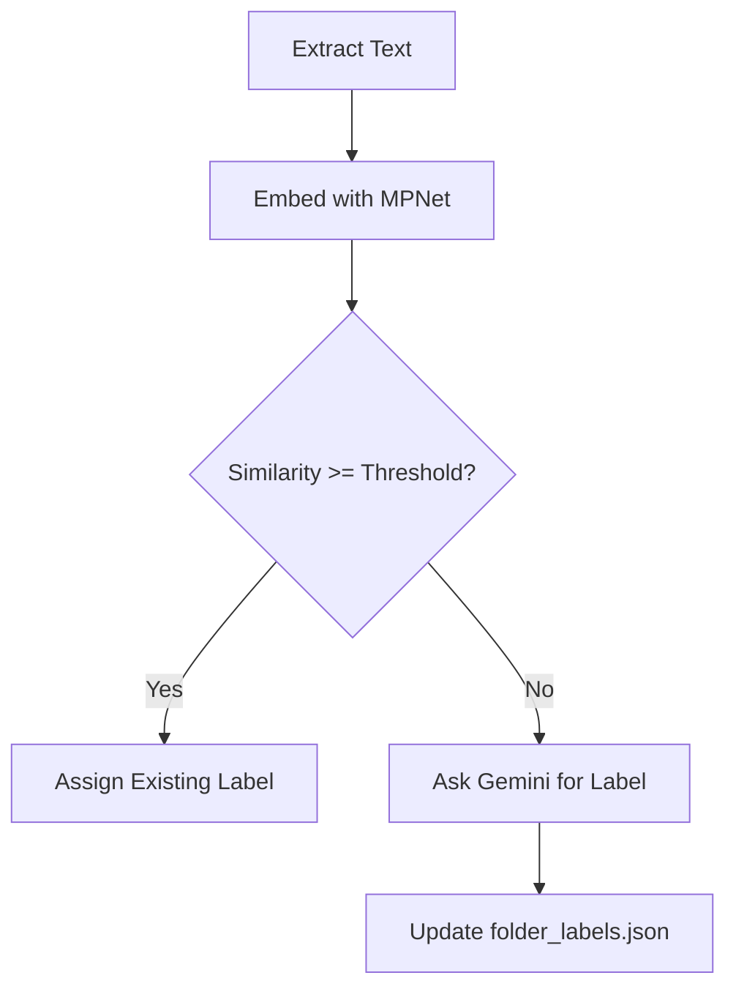

# FileSense Documentation Template

---
title: "PAGE TITLE HERE"
layout: single
permalink: /wiki/page-slug/
sidebar:
  nav: wiki
toc: true
toc_sticky: true
---

# Page Title Here
Short intro paragraph explaining what this page is about.

---

# 🔥 Quick Summary

- Bullet point 1  
- Bullet point 2  
- Bullet point 3  

---

# 🧩 Section Heading
Explain something clearly.

## Subsection
Explain the subsection.

```python
# Code example
def demo():
    return "Hello World"
```

---

# 💡 Tip / Note / Warning Blocks

**Tip**
{: .notice--info}

**Note**
{: .notice--success}

**Warning**
{: .notice--danger}

---

# 📁 Directory Structure Example

```text
FileSense/
├── landing/
├── wiki/
│   ├── index.md
│   ├── template.md
│   ├── usage.md
│   └── ...
└── folder_labels.json
```

---

# 🧪 Code Blocks

```python
print("Python")
```

```bash
pip install filesense
```

```json
{
  "folder_label": "Physics",
  "keywords": ["energy", "forces"]
}
```

```yaml
theme: minimal-mistakes-jekyll
```

---

# 📌 Tables

| Feature | Description |
|--------|-------------|
| Labeling | Assigns folder labels using vectors + LLM |
| Merging | Ensures metadata is never lost |
| Movement | Organizes files automatically |

---

# 📥 Download Button Example

<a href="/FileSense/assets/example.json" class="btn btn--primary">Download JSON</a>

---

# 🖼️ Images

Local:


External:


---

# 🧠 Mermaid Diagram



---

# 🧱 Callouts

> Important information here.

---

# 🔄 API Section Template

## Function `generate_folder_label(text)`

**Returns:**

```json
{
  "folder_label": "Physics",
  "description": "mechanics, forces, motion",
  "keywords": "physics, energy, force"
}
```

---

# 📦 Installation

```bash
pip install -r requirements.txt
```

```env
API_KEY=your_gemini_key
```

---

# 🧭 Navigation Footer

[← Back to Docs Overview](/FileSense/wiki/)
